# SOF output file analysis

Each post (`question or answer`) and user in the Stack Overflow dataset has its own unique identifier value, a primary key that allows efficient indexing and retrieval of posts and user information. Amount identifiers are commonly used as a reference point when working with datasets, providing a way to identify and link related pieces of unique information.

Now here we discuss all the sections related to `SOF`

## Tags

>1 .[`• Id `](#1--id) : An ID for the post. 
2 . [`• PostTypeId `](#2--posttypeid) : ID that shows the type of post . In this case , it is set to "2" which corresponds to a response. 
3 . [`• ParentId `](#3--parentid): The ID of the question that this answer answers . In this example , the answer is related to the question that has the ID value " 36 ". 
4 . [`• AcceptedAnswerId`](#4--acceptedanswerid) : ID of the accepted answer for this question . In this example , the rejected response has the ID value "519 ". 
5 . [`• CreationDate `](#5--creationdate): The date and time the post was created . 
6 . [`• Score` ](#6--score):A nation of The popularity of the post , based on the . 
7 . [`• ViewCount`](#7--viewcount) : The number of dozens of results that the question has dropped . 
8 . [`• Body` ](#8--body): The main content of the post . In this case, it contains the HTML coded text of the question , which is related to the problem of making calls . HTTP on your website Explains Ruby on Rails and includes a KPM error and stack trace . 
9 . [`• OwnerUserId`](#9--owneruserid) : ID of the user who sent this question . In this example , the user has the ID value "151 ". 
10 . [`• LastEditorUserId`](#10--lasteditoruserid) : ID of the user who last edited the post . 
11 . [`• LastEditorDisplayName`](#11--lasteditordisplayname) : The display name of the user who last edited the post . 
12 . [`• LastEditDate`](#12--lasteditdate) : The date and time the last post was edited . 
13 . [`• LastActivityDate`](#13--lastactivitydate) : The date and time of the last activity in the post . 
14 . [`• Title`](#14--title) : Title Question . 
15 . [`• Tags`](#15--tags) : Tag related to the question . In this case , the tags include " Rail Force " , " Aqot " and "Crash" . 
16 . [`• AnswerCount`](#16--answercount) : The number of answers that the question has received . 
17 . [`• CommentCount`](#17--commentcount) : The number of comments on the pos. 
18 . [`• FavoriteCount`](#18--favoritecount) : The number of times the question has been marked as a favorite   

# Description of Tags
---- 
### 1- `id` 

An `ID` for the post. 

>For example :
>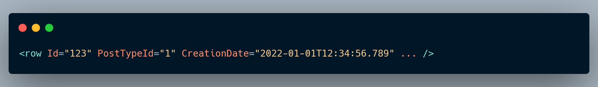

### 2- `PostTypeId` 
----
Stack Overflow 's data schema , the spec `PostTypeId` It shows the post type . Here are some of the values for you `PostTypeId` It comes with their meanings :

* 1 . **Question** ( `PostTypeId = 1`) This type indicates the question sent by the user .  
* 2 . **Answer** ( `PostTypeId = 2`). This type of answer shows a response sent to a question .  
* 3 . **Wiki** ( `PostTypeId = 3`) This type represents a community wiki post . Community Wiki posts are shared by the community and no credit is given to the users who share them .  
* 4 . **Tag Wiki** ( `PostTypeId = 4`) This type represents a post and a tag . Tag wikis provide information about a specific tag .  
* 5 . **Tag Wiki Excerpt** ( `PostTypeId = 5`): This type shows a wiki tag , which is a shorter version of a wiki tag .  
* 6 . **Moderator Nomination** (`PostTypeId = 6`): This type shows the moderator nomination post , where users can nominate themselves to be a moderator .  
* 7 . **Wiki Placeholder** (`PostTypeId = 7`) This is a type of placeholder for It shows a post and a forum . 
 

### 3- `ParentId` 
---
The ID of the question that this answer answers . In this example , the answer is related to the question that has the ID `value 36`.

>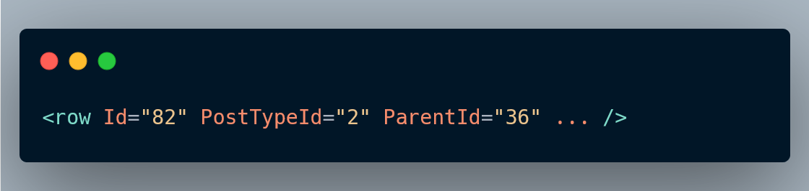 

### 4- `AcceptedAnswerId`
---
This shows that the question with ``ID 514`` has a rejected answer to the answer with ID 519 .
on your website Stack Overflow , the person who raised a question has the option to mark one of the answers to his question as " rejected " . This is usually the answer that the questioner finds more useful Yes is the answer that has solved his problem in the best way . `AcceptedAnswerId` in the question record is set on the ID of the accepted answer .

>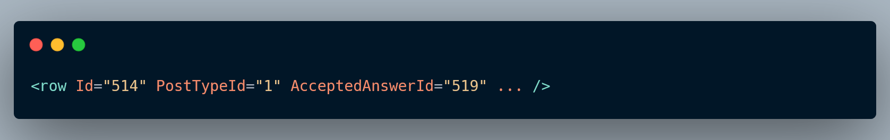 

### 5- `CreationDate`
---
These show the activity time of a post - `CreationDate` the time it was first asked / answered , and LastActivityDate It records the time when the last activity was performed .

>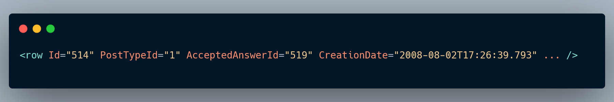 

### 6- `Score`
---
And the `Score` mark in Stack Overflow shows the net sum of positive and negative votes that a post ( question or answer ) has received . A community is basically a measure of a post 's popularity or perceived quality in the Stack Overflow community .

>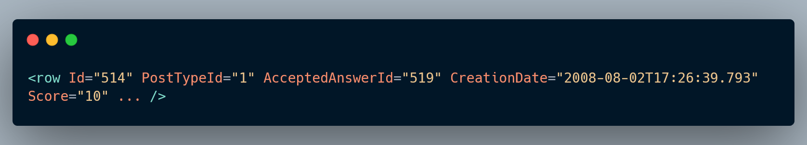 

This shows that the question with `ID 514` has a score of 10 . A score of 10 shows that question 10 received more positive votes than negative votes .

Here is how the community system works in general on Stack Overflow :

    + Up vote : When a user finds the question or answer useful , he can give it a positive vote . Each upvote adds 1 to the number of posts .

    - Negative vote : on the contrary , if the user finds the question or answer useful If it is false forever , it can give it a negative meaning . Each negative vote will reduce the number of posts by one .

The number of votes is the result of the accumulation of positive and negative votes . A positive score indicates that the post received more positive votes than a negative one , while a negative score indicates the opposite .

It is important to note that the system is subjective and can differ based on user opinions . The goal is to highlight content that is useful to the community It is considered valuable . In addition , it contributes to the user 's reputation on the platform .

### 7- `ViewCount`
---
Property `ViewCount` In the ninth field of Stack Overflow, it shows the number of hits that a question has received . `ViewCount` The measurement is the number of times users have accessed the question page .

>For example : 
>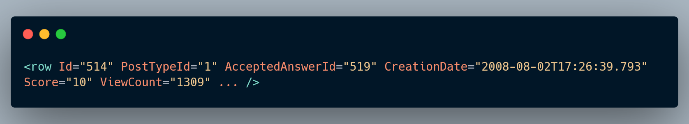 

This shows that the question with `ID 514` has `ViewCount` is 1309 , which means that the question has been viewed 1309 times .

Number `ViewCount` It usually increases every time a person views the question page forever It has no effect on whether the user is logged in or not, and does not consider whether the user interacts with the question ( eg , voting , answering ) . This simply shows how many times the question page has been loaded .

The number of hits can be an indicator of your popularity or the visibility of a question in the Stack Overflow community . Usually, questions with a higher number of returns have attracted the attention of users. However , it is important to note that `ViewCount` Necessarily quality It does not reflect the correctness of the question . This is just a measure that shows how many times the question page has been accessed .

### 8- `Body`
---
In the data plan Stack Overflow , and Ye Jag `Body` is the main content One shows the post , whether it is a question or an answer. `Body` contains the textual content of the post, including formatting , code snippets, and other elements .

>For example :  
>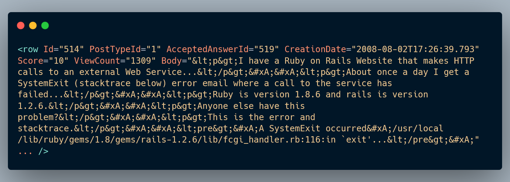 

For responses , the `Body` tag similarly contains the body of the response , including any formatting and code snippets .

It is important to note that the content in `Body` may be used to ensure proper rendering and prevent potential security issues such as XSS with HTML code . When displaying content , the Stack Overflow platform decodes this HTML - encoded content to render it appropriately on the web page 

### 9- `OwnerUserId`
---
the Stack Overflow data scheme , and `OwnerUserId` represents the ID of the user who submitted a specific question and answer . This feature is used to link a post to the user who created it .
>For example : 
>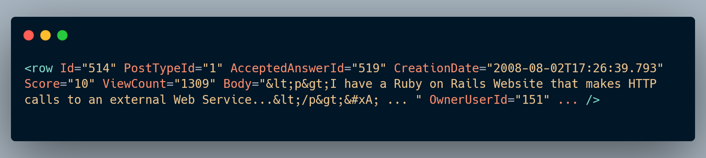 

This shows that the question with `ID 514` was sent by the user with ID 151 .

Similarly , for the answers , and `OwnerUserId` identifies the user who submitted the response . Any user on Stack Overflow It has a unique identifier (Id) and this identifier is used to associate posts with their respective owners .

It is important to note that if `OwnerUserId` on NULL can be set or not present , which means that the post is not associated with a specific user . This situation may occur for posts created by users who have since deleted their accounts or for posts created by unregistered users ( users who have not created a Stack Overflow account ) should be created .

Information `OwnerUserId` is important for tracking contributions , understanding user activity , and attributing posts to specific people in the Stack Overflow community .

### 10- `LastEditorUserId`
---
In the data plan Stack Overflow , and Ye Jag `LastEditorUserId` indicates the ID of the user who last edited a specific post ( question or answer ) . This feature is used to associate a post with the user who last edited it .

>For example : 
>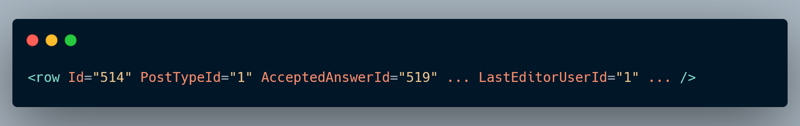 

This shows that the question with `ID 514` was last answered by the user with ID 1 and y .

It is necessary to pay attention to this point that if `LastEditorUserId` on If it is set to NULL or does not exist , it means that the post has not been updated or the information is not available in the dataset . This may happen to posts that have n't had any updates since they were posted .
Information `LastEditorUserId` helps the transparency and responsibility of the shared process in the platform .

### 11- `LastEditorDisplayName`
---
the Stack Overflow data plan , and the `LastEditorDisplayName` Indicates the display name of the user who last viewed a specific post ( question or answer ) . This feature is used to associate a post with the display name of the user who made the last changes in it .

>For example : 
>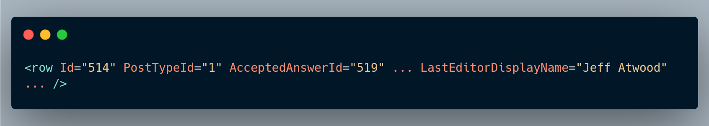 

with `ID 514` was last viewed by a user with the display name " Jeff Atwood " .

Similarly , for the answers , `LastEditorDisplayName` The display name identifies the user who made the last changes in the response .

It is important to note that if characteristic `LastEditorDisplayName` If it is set to NULL or does not exist , it means that either the post has not been created or the display name information is not available in the dataset . This may happen to posts that have been updated since then . And they did not have an object or in the data sets that did not include the object display names .

Information `LastEditorDisplayName` is useful for displaying the username of the user who edited the last post , and provides a human - readable display of the user 's identity . Gives . Display names are more user - friendly than numeric user IDs and are usually displayed on a website . Stack Overflow are used to identify users .

### 12- `LastEditDate`
---
In the data plan Stack Overflow , and Ye Jag `LastEditDate` indicates the date and time when a particular post ( question or answer ) was last edited . This is a sign for tracing the water seal of the last time of his reign . A post is used .

>For example : 
>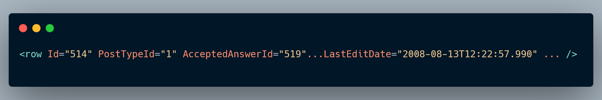 

Similarly , for the answers , and `LastEditDate` specifies the date and time of the last response .

It is important to note that if `LastEditDate` on If it is set to NULL or does not exist , it means that the post has not been posted or the timestamp information is not available in the dataset . This may happen to posts that have not had anything since they were created , or to datasets that do not include historical information . Is.

Information `LastEditDate` to understand the content A post and a timeline of the changes made in it would be valuable. This helps the transparency of the joint process in the Stack Overflow platform .

### 13- `LastActivityDate`
---
the Stack Overflow data plan , and the `LastActivityDate` It shows the date and time of the last activity in a particular post ( question or answer ) . This widget is for tracking the latest post updates , including updates , comments , and reviews . or any other activity that changes the post is used .

>For example : 
> 

This shows that the question with `ID 514` was last active on January 9 , 2013 at 05:48 : 04.717 .

Similarly , for the answers , `LastActivityDate` It specifies the date and time of the last activity in the response .

It is important to note that " activity " in this context does not refer to any post - related interaction , including comments , comments , votes , etc. Refers to user actions . `LastActivityDate` It provides a comprehensive timestamp for the last event that affects the post .

If and if `LastActivityDate` If it is set to NULL or does not exist, it means that no activity has been performed on the post or the activity timestamp information is not available in the dataset . . This may happen to posts that have not had any activity since they were posted .

Information `LastActivityDate` is valuable for understanding the interaction of recent changes to a post and helps users identify content that has been recently updated or interacted with .

### 14- `Title`
---
In the data plan Stack Overflow , and Ye Jag `Title` shows the title of a specific post , either It 's a question The answer is yes . This email contains the content of the post title text .

>For example : 
>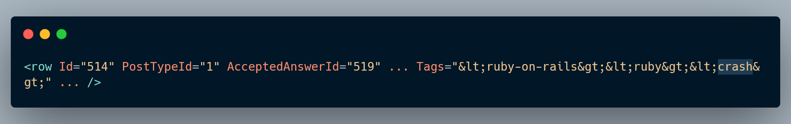 

This shows that the question with `ID 514` titled " Exit repeatedly from the system in Ruby when making calls HTTP " has

Titles to summarize the topic of the main question Posts are very important and are often the first thing users see when browsing or searching for content on Stack Overflow . A well - made title can significantly affect the visibility and comprehensibility of a post .

It is important to note that the title feature is specific to questions and cannot be used for answers . Answers are usually untitled. They contribute to the content of the question they are related to .

`Title` information for displaying posts in search results , question lists , and various other places on the website . Stack Overflow , which shows the summary of the posts , is used .

### 15- `Tags`
---
In the data plan Stack Overflow , and Ye Jag `Tags` shows `tags` related to a specific question . 
`Tags` are general words There are `tags` that are used to categorize and organize questions and make it easier for users to find content related to specific topics .

>For example : 
> 

This shows that the question with `ID 514` is tagged with three `tags` : ruby-on-rails ", " ruby " and " " crash ".

`Tags` are for organizing content on Stack Overflow and helping users to Answering questions related to specific technologies , programming languages Interests are important. Users can follow `tags` to receive notifications about new questions in their specialty area of interest .

It is necessary to pay attention to this point that `Tags` are for questions. Answers are not labeled. They inherit the `tags` from the related question.

Labels information for various purposes on the website Stack Overflow includes filtering questions, searching for specific topics , and displaying related questions in the sidebar based on common `tags` .

### 16- `AnswerCount`
---
In the data plan Stack Overflow , and Ye Jag `AnswerCount` shows the number of answers that a particular question has received . This feature is used to show the number of users who have answered a specific question .

For example : 
>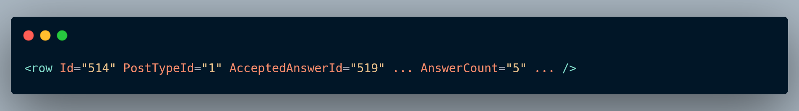 

This shows that the question with `ID 514` has received 5 answers .

`AnswerCount` is valuable for users to quickly gauge the level of community engagement with a specific question . A higher number of answers may indicate that the question is complex , popular , or has multiple solutions .

It is necessary to pay attention to this point that `AnswerCount` is specific to questions and does not apply to answers . The answers have a meaning `AnswerCount` does not stand for answers to questions.

Information `AnswerCount` on your website Stack Overflow to display the number of answers A question is used and provides users with a quick overview of community activity and response related to a specific question .

### 17- `CommentCount`
---
Stack Overflow data scheme , and `CommentCount` The number of comments that a particular post ( or question ) has It shows that the answer has dropped . This feature is used to show the number of users who have added comments to a particular post .

>For example : 
> 

This shows that the question with `ID 514` has not received any comments .

On the Stack Overflow website , users can post comments to clarify , provide additional information . Discuss the aspects of Add a post. Property `CommentCount` A view is a number of the total number of comments related to a particular post .

It is necessary to pay attention to this point that `CommentCount` It applies to both questions and answers . Both questions and answers can have comments related to them .

Information `CommentCount` on your website Stack Overflow is used to display the number of comments on a post and provides users with an indication of the level of discussion and additional information related to a particular post .

### 18- `FavoriteCount`
---
Stack Overflow data plan , and the `FavoriteCount` It shows the number of times a particular question has been marked as a favorite by users . This feature is used to show the number of users who have added a particular question to their list of favorite questions .

>For example : 
>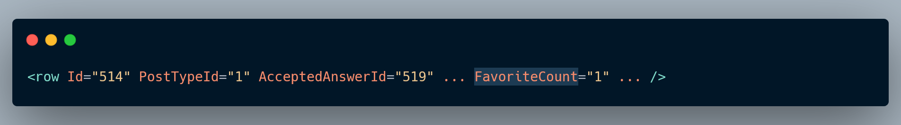 

This shows that the question with `ID 514` has been liked by 1 user .

On the Stack Overflow website , users can mark questions as favorites for easy tracking and revisiting later . Property `FavoriteCount` Provides the number of users who have added a particular question to their favorites list .

It is important to pay attention to this point that `FavoriteCount` It is for questions and cannot be used for answers . The answers have a meaning `FavoriteCount` are not .

Information `FavoriteCount` on your website Stack Overflow for your popular show It is used to measure the interest that a particular question has gained from the community . A higher `FavoriteCount` indicates that this question is of interest to users and has been saved by them for future reference .

